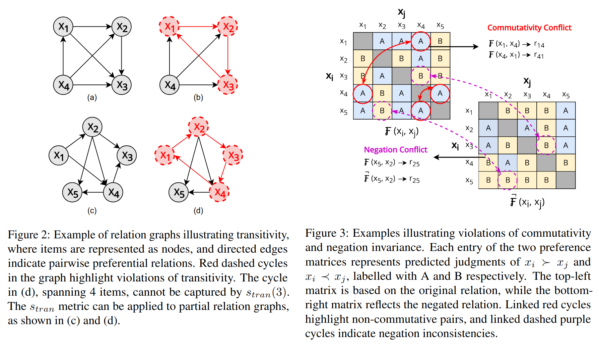

# LLM consistency/robustness

### Aligning with Logic: Measuring, Evaluating and Improving  Logical Preference Consistency in Large Language Models

In this paper they measure three types of logical consistency:
- Transitivity: If A > B and B > C, then A > C
- Commutativity: If A > B, then B < A
- Negation conflict: If A > B then not(B > A)

In this context, the relation > is the preference of one answer over the other, so if the preference graph has cycles, it implies that the model has logical inconsistencies.

They propose metrics for each logical consistency type, and propose REPAIR, a method that generates a pairwise dataset to improve logical consistency. 

It uses a datasets that focus on choosing between two answers, and then uses loss rate method to solve the rank aggregation problem. (If A wins to B, C and D, but losses to E and F, the score for A will be (win-loss)/total = (3-2)/5 = 0.2)

Results found that:
- "Zero-shot inference shows considerable logical inconsistency."
- Commutativity correlates strongly with human preferences (they also compared model outputs with the dataset labels)
- "Surprisingly, CoT reasoning did not generally improve consistency, and in some cases, it led to a decrease in transitivity performance"
- Training with REPAIR improves transitivity and commutativity

---

### Multidimensional Consistency Improves Reasoning in Language Models
This paper studies consistency on LLMs by making changes to the prompt (no training is performed)

They work with three types of consistency:
- Language (CLC) -> Changing language effects performance on QA/Math benchmarks.
- Paraphrasing (CPC) -> Same question asked differently.
- Order consistency (COC) -> Few-shot changing the example order.

They calculate consistency by dividing the maximum number of equal answers divided by the total amount. 

Results:
-  Consistency scores are like this: order > paraphrasing > language.
- COC improves all models on GSM8K and MATH500, showing that aggregating across different few-shot orders is useful
- CPC is the strongest individual method overall. Rewriting the question and then solving it often helps, but using only the rewritten question can lose information.
- Combining dimensions helps more: aggregating across order, paraphrase, and language usually gives the best or near-best accuracy.
- COC and CPC strongly correlate with model accuracy, so they may be useful as confidence/uncertainty signals without needing the gold answer

