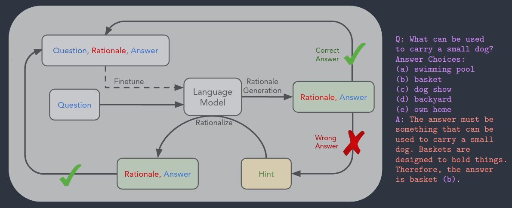
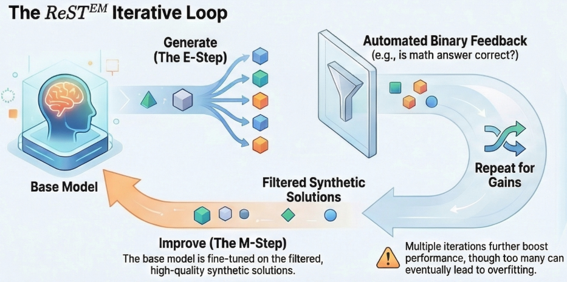
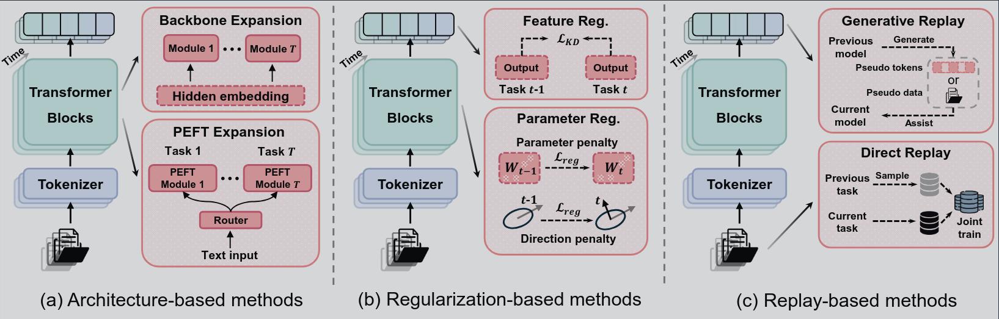
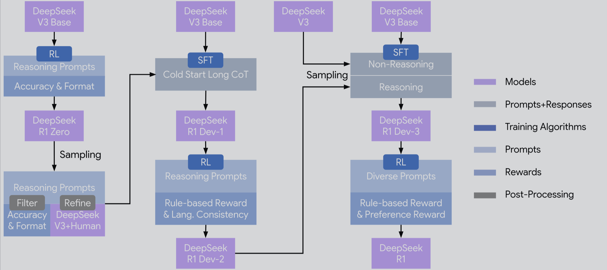
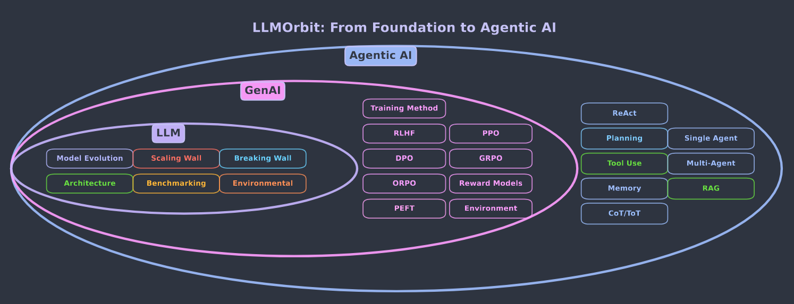
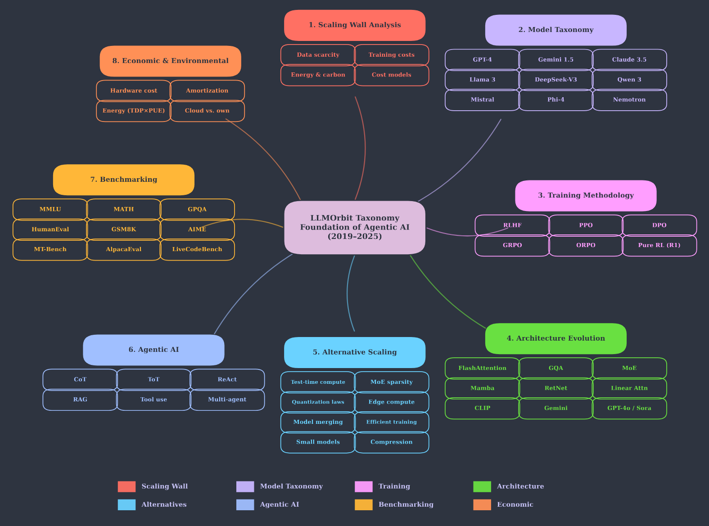
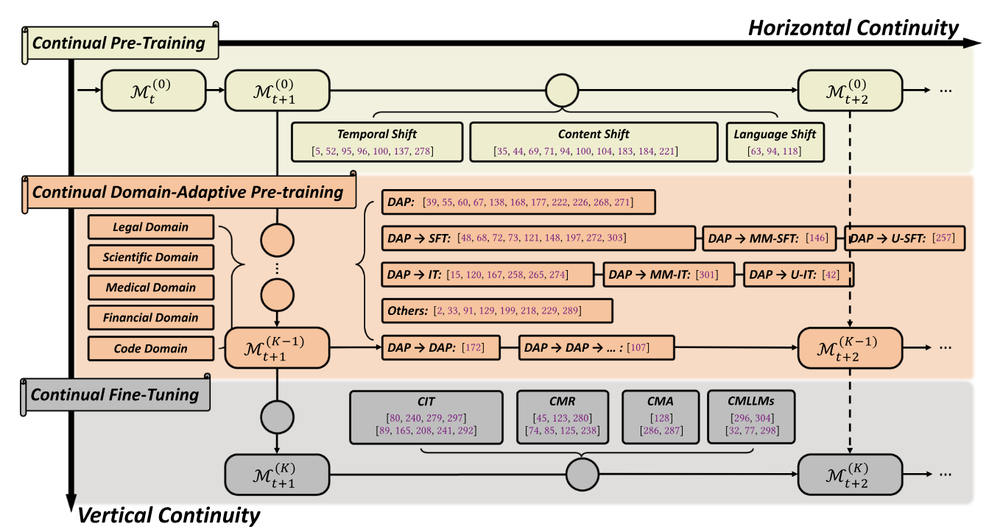

## ♻️ Continuous Improvement

### May 2025 — AlphaEvolve: A Gemini-Powered Coding Agent for Designing Advanced Algorithms

**Paper:** [AlphaEvolve (PDF)](https://storage.googleapis.com/deepmind-media/DeepMind.com/Blog/alphaevolve-a-gemini-powered-coding-agent-for-designing-advanced-algorithms/AlphaEvolve.pdf)  
**Blog:** [DeepMind Announcement](https://deepmind.google/discover/blog/alphaevolve-a-gemini-powered-coding-agent-for-designing-advanced-algorithms/)

**Summary:** AlphaEvolve is a system that leverages LLMs to iteratively improve a code that solves a problem. They find that for mathematical problems it works better to optimize the code that will find the solution (such as an heuristic search) than trying to find the solution directly.

It has 4 components:

1. Prompt optimization
2. Automated evaluation functions
3. A database with the code instances generated + the evaluation feedback
4. An ensamble of LLMs that direct the code evolution

System workflow:

1. A human creates an initial prompt with problem definition + examples + initial code to evolve
2. LLMs propose changes to the code
3. The code is evaluated and both the code and the results are added to a Data Base
4. The codes to evolve for the next concurrent iterations are selected from the DB using MAP elites algorithm and island-base population models
5. An LLM is also asked to improve the current prompt
6. Back to step 2

They use this system to optimize 4x4 matrix multiplications, kernel operations, computer center resource managing systems, TPU design, etc.

---

### Can Large Language Models Invent Algorithms to Improve Themselves?:Algorithm Discovery for Recursive Self-Improvement through Reinforcement Learning

**Paper:** [arXiv](https://arxiv.org/abs/2410.15639)

**Summary:**
The objective is to iteratively improve a base model by merging it with fine-tuned versions. The contribution is that another SLM is in charge of creating the new merging strategies.
The loop goes as follows:

1. Programming model creates a merging algorithm
2. Base model is merged with fine-tuned versions of the same model
3. Resulting model is evaluated with two benchmarks
4. The benchmark results and the merging code is used to create preference data and train the programming model with DPO
5. Go back to step 1

What are task vectors?? The weights generated during the training of the LoRA fine tunning.

---

### Darwin Godel Machine: Open-Ended Evolution of Self-Improving Agents

**Paper:** [arXiv](https://arxiv.org/abs/2505.22954)

**Summary:**
They say that improving coding capabilities = learning to improve itself, but I disagree. To make breakthroughs, intuition and knowledge are way more necessary than coding skills.

The system they propose consists in a loop of improvement of the code base that uses closed models to perform programming tasks. They prompt the model to improve both the tools (bash access and edit tool) used and the workflow (such as iterative problem solving and retries, history-aware generation and context management).
They evaluate all this with some open-source benchmarks and create a DB that the next prompts will use.

NOTE: The title is misleading, there is no self-improving agents, and the evolution of the system that uses the frozen Foundational Models is quite closed. Also, the paper is super repetitive and the writing is verbose. I suspect LLMs have been really involved in the writing.

---

### Mitigating Tail Narrowing in LLM Self-Improvement via Socratic-Guided Sampling

**Paper:** [arXiv](https://arxiv.org/abs/2411.00750)

**Summary:** Self-improvement techniques consist on making the model generate synthetic data that then will be used to continue training the model.
But due to the Tail Narrowing effect, in which the model only gets better at the things it already knows how to do, the improvement stops at some near point. To mitigate this issue, the paper proposes to guide the synthetic data generation, to make the model more likely to create useful and correct data.

They make it with 4 approaches, they already have a dataset with reasoning paths and answers:

1. Providing the final answer to the model and letting it create the reasoning.
2. Providing the reasoning and letting the model generate the final answer.
3. Provide only a portion of the reasoning path, making the model complete it and generating the answer
4. When the model fails, a bigger model is prompted to explain the correction, and the inference is re-executed with the new info.

This methods are compared with SFT with the dataset and with the vanilla Self-Improvement implementation.
Results show that when the fine-tuning is done with 3, the results in the evaluation benchmarks (that are different than the ones used for the fine-tuning) show that 3 works better in general, and that 1 fails when the model do not have enough reasoning capabilities.

---

### Self-Consuming Generative Models Go MAD

**Paper:** https://openreview.net/forum?id=ShjMHfmPs0

**Dictionary:**
Sampling bias is a parameter that can make the model sample only from the top of the distribution, or to make the generation synthesise more diverse data. In LLMs it would be the temperature parameter. 

**Summary:** They present three self-consuming techniques for GAN and Difussion architectures:

- Fully synthetic loop:
  
- Synthetic augmentation loop
- Fresh data loop

Fréchet inception distance -> Uses high-level features from a CNN to compare the mean and covariance of the generated images and the ones in the dataset. Low values -> High generation diversity.

---

### Unlocking LLMs’ Self-Improvement Capacity with Autonomous Learning for Domain Adaptation

Paper: https://aclanthology.org/2025.findings-acl.1084/

Summary: They propose a two stage self-training process: The Open-Book and Closed-Book one:

- Open-Book: They take a data corpora D and prompt the LLM to generate a pair (Q, Ao), where Q -> Question and Ao -> Answer with book opened (having D as context). Then they do SFT on this generated QA dataset.
- Closed-Book: They generate Ac, which are the model's answer to the questions Q without having D as a context, and apply DPO (Direct Preference Optimization) to train the models with the pairs (Ac,Ao).
  They find that this approach improves benchmark performance on the specific domains, better than the baselines: Pre-Training, SFT, RAG, IL (Imbalance Learning), Self-Tuning and SPIN.

Questions: Does the training loss only apply for the answer tokens? Or all of them? It seems that only to the answer ones.

### Large Language Models are Superpositions of All Characters: Attaining  Arbitrary Role-play via Self-Alignment

Paper: https://aclanthology.org/2024.acl-long.423/ 

Summary: It introduces DITTO, a framework in which synthetic data is generated by a LM, regarding roleplaying of a given character, and then is fine-tuned with it.

They generate using Wikipedia and Wikidata:
- Role-play data (Respond like x, having this data y)
- Contrastive data (Given this question about z character, respond like x). This ensured that there are boundaries for the role-playing response.

Then they fine-tuned the models and made test about:
- Role-playing consistency: They prompt a LLM judge to tell if the response from a model was from character a,b,c or d.
- Knowledge related: Same, prompted a LLM judge to tell if fine-tuned model responded accordingly to data x.
- Unknown question rejection: LLM judge that tells if the fine-tuned model was able to tell that the question asked was about another character.

Results:
- All fine-tuned model sizes (From Qwen 1.8 to Qwen 72B) improved in the role-identity bench.
- Knowledge about character is assimilated better on the bigger models.
- High-quality supervision is not strictly required for learning role-play style (72B model trained with data from the 1.8 one performs good).
- Knowledge injection during synthetic dialogue generation significantly improves performance.

### STaR: Self-Taught Reasoner  Bootstrapping Reasoning With Reasoning

They generate rationales for a question-answer dataset by using few shot learning. Specifically:
The model generates a rationale to solve it and then provides an answer. If a wrong answer is provided, it is added to the prompt to facilitate the model the writing of the rationale.
Finally the model is fine-tuned, and the cycle starts again.
To avoid over-fitting, each time the model is fine-tuned, it starts from the base model, and using all the data generated since the beginning.

They generate data for this tasks:
- 1 to 5 digit additions
- Commonsense question answering
- Grade school math (GSM8K)

And in all of them the accuracy is increased.

### Beyond Human Data: Scaling Self-Training for Problem-Solving with Language Models

They implement an expectation-maximization technique.
The objective is to allow the model to train itself in a specific domain such as maths or programming. 
For that they provide a binary reward function that will be used to tell the model if a generated response is correct or not. If so, it will be added to the dataset that will later be used for fine-tuning the model.

Results:
- It is bettter to train the model from scratch that to perform continuous updates, which produces model degradation.
- Performance scales with datset size.
- When performing more than one iteration on the programming data, it degraded the performance of HumanEval, but for maths, it didn't. 
- No degradation of general capabilities, they use BIG-Bench hard to evaluate.
- pass@k improves for all k. This is important because it reflects capability (pass@1 reflects reliability instead)

### A Comprehensive Survey on Continual Learning  in Generative Models

This survey classifies the continual-learning techniques in 3 groups:
- Arquitecture-based: Where arquitecture modules are added/modified to the base-model.
- Regularization-based: This techniques try to prevent the initial distribution from changing too much, as it produces forgetting.
- Replay-based: The data used to train the model or synthetic auto-generated data is used to mix with the new task data, mitigating forgetting.

Interesting ideas presented:
- When doing continual-learning, performance drops for disrupted alignment, not for erased knowledge.
- Forgetting happens becouse of biased function activation, not for parameter overwriting. 

### DeepSeek-R1: Incentivizing Reasoning Capability in LLMs via Reinforcement Learning

The image ilustrates the pipeline used for the Deepseek-R1 training.

They use GRPO (Grouped Relative Policy Optimization) as the RL algorithm, which consists on generating with a model several responses, evaluating the outcome with a rule-based model, and computing the reword for each one in relation to the others and normalized: $$r = r - \frac{\text{avg}(r_s)}{\text{std}(r_s)}$$
Where r is the reward, and rs all of them grouped.

Findings:
- The model can do reward hacking during training
- RL algorithm makes discovers autonomously techniques to improve response accuracy such as: re-evaluate, double-check results, validate, allocate thinking time (in tokens), valance exploration and exploitation.
- Imposing human way to think through SFT -> Worse model performance 
- To compute reward, they use both rule-based techniques (for coding and mathematics) and other LLMs, changing the head to output a reward number (they need additional training).

### LLM Orbit

#### Paradigm shifts:
- Post-training dominance (RL)
- Test-time compute scaling
- Efficiency revolution (Multi-head latent attention, moes, flash attn, GQA, quantization, etc.) -> 100x cost reduction in the last 2 years

#### Challenges and future directions:
- Evaluating reasoning beyond final answers
- Make the test-time compute adaptive to problem complexity
- Verifiable rewards on open-ended problems.
- Incorporate new info without retraining nor catastrphic forgetting
- Correcting errors and updating knowledge (model editing)
- Personalizing to user preferences over time
- Ensure synthetic data quality (avoiding model collapse from training on own outputs)
- Curriculum that target capability gaps
- Understanding theoretical limits of self-improvement

Extra notes:

Model collapse depends on:
- The ratio of synthetic to real/high-quality data
- Whether the synthetic data is diverse
- Whether it is filtered for correctness
- Whether it targets useful capability gaps instead of just recycling typical outputs

### Continual Learning with Pre-Trained Models: A Survey

This paper focuses on classification tasks, and classifies the CL (continual learning) in three classes:
- Prompt based: Where a learned prompt is appended to the input during the inference. This shifts the model distribution to also be able to classify the new classes.
- Representation based: It computes for each class the mean of an intermediate state of the network, and then during inference it compares the intermediate state of the input with the mean of each class and outputs the class with the most similar representation.
- Model mixture: Here it mixes different models to aliviate forgetting. 

### Continual Learning of Large Language Models: A Comprehensive Survey

They argue that there is vertical and horizontal continuous learning (CL).

Vertical is the one that specializes the model on one topic/task and is divided in:
- Pre-Training: Described as understudied. The current best approach is to use architecture expansion techniques.
- Domain Adaptive Pre-Training (DAP)
- Task fine-tuning

Then, there is the horizontal CL that are the model updates regarding the information changes, new discoveries, etc. It is the one that ensures that the model is up to date, as well as the most difficult to perform without catastrophic forgetting (the distribution shifts are higher than in the vertical CL)

Interesting facts:
- The location for storing the fact may not coincide with the best place for editing it
- When fine-tuned sequentially and cyclically on a series of documents, large models exhibit a phenomenon known as "anticipatory recovering". This suggest that LM may be capable of sequential memorization  
IDEA:
- Find less important weights (pruning algorithm) + fine-tuning only those weights -> Less forgetting?

---
TOREAD:
- Self-instruct: Aligning language models with self-generated instructions (2023)
- Self-rewarding language models (2024)
- Self-refine: Iterative refinement with self-feedback (2024)
- Language model self-improvement by reinforcement learning contemplation (2024)
- Large language models can self-improve (2023)
- Promptbreeder: Self-referential self-improvement via prompt evolution (2023)
- Reflexion: an autonomous agent with dynamic memory and self-reflection (2023)
- Reflexion: Language agents with verbal reinforcement learning. (2024)

